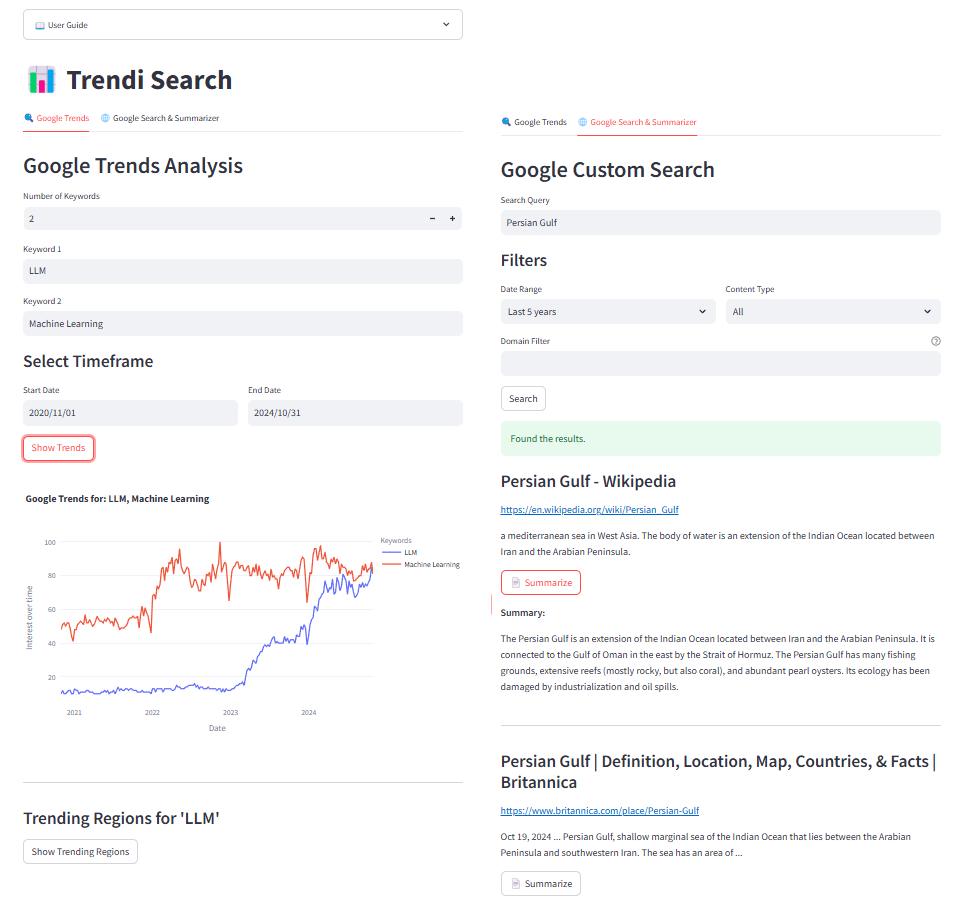

# 🔍 Trendi Search

Trendi Search is a web application built with Streamlit that allows users to explore Google Trends data and perform Google Custom Searches with summaries. It features trend analysis of specified keywords and offers summarization of web content using a pre-trained [**facebook/bart-base**](https://huggingface.co/facebook/bart-base) model.

Try my app: https://trendisearch.streamlit.app/ 

## Features

- **📈 Google Trends Analysis**: Visualize trends for specified keywords over a selected time frame.
- **📉 Trending Regions Visualization**: Display a geographic map showing the regions where a keyword is trending.
- **🌐 Google Custom Search with Summarizer**: Perform a Google Custom Search with options to filter by date range, content type, and domain. Summarize content from the results for quick insights.

## Overview



## Installation

1. Clone this repository:
   ```bash
   git clone https://github.com/parsafarshadfar/trendi_search.git
   cd trendi_search
   ```

2. Install dependencies:
   ```bash
   pip install -r requirements.txt
   ```

3. Add your tokens to the app.py:
   - **API_KEY**: Google Custom Search JSON API key.
   - **CSE_ID**: Google Custom Search Engine ID. 
   

## Usage

Run the app with the following command:
```bash
streamlit run app.py

or 

python -m streamlit run app.py
```

### Google Trends Tab
1. Specify the number of keywords and input each keyword.
2. Select the start and end dates for trend analysis.
3. Click "Show Trends" to generate trend graphs.
4. Click "Show Trending Regions" to view a geographic map for the first keyword.

### Google Search & Summarizer Tab
1. Enter the search term in the **Search Query** field.
2. Set filters like date range, content type, and domain (optional).
3. Click "Search" to perform the search.
4. Click "Summarize" to generate a summary of the content for each result.

## Dependencies

The main dependencies are listed in `requirements.txt`:
- `streamlit==1.39.0`
- `pytrends==4.9.2`
- `plotly==5.24.1`
- `requests==2.32.3`
- `beautifulsoup4==4.12.3`
- `torch==2.5.1`
- `tensorflow==2.18.0`
- `transformers==4.46.1`
- Additional dependencies are specified in the file.

## Acknowledgments

- Google Trends API for trend data
- Google Custom Search API for search functionality
- Hugging Face for the [**facebook/bart-base**](https://huggingface.co/facebook/bart-base) summarization model
